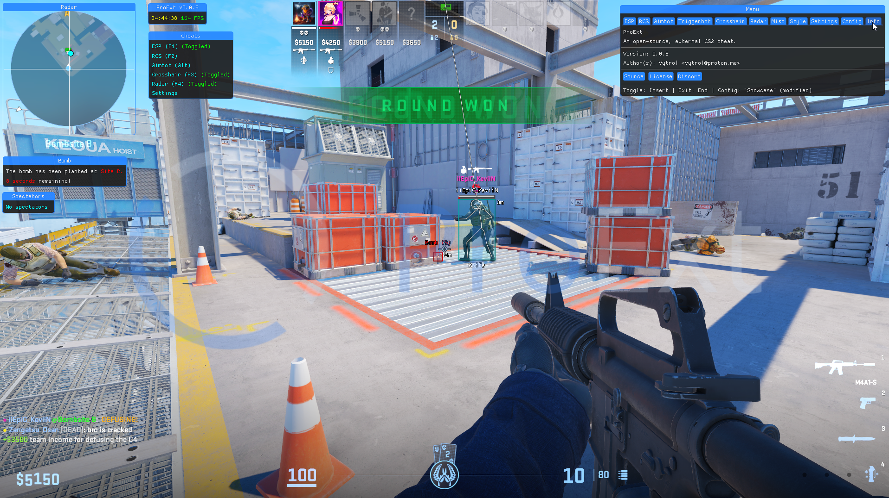

    

    <i>An open-source, customizable cheat for Counter-Strike 2.</i>

<h2>🖼️ Preview:</h2>

    

<h2>📝 Instructions:</h2>
To use ProExt, you can follow two methods.

<h3>Method 1: Download the prebuilt binary</h3>

This method is the easiest and is recommended for most. You can find the latest binary <a href="https://git.snipcola.com/snipcola/ProExt/raw/branch/main/bin/proext.exe">here</a>.

<h3>Method 2: Build the application</h3>

<h4>Dependencies:</h4>
<ul>
    <li><a href="https://winget.run/pkg/Microsoft/PowerShell">PowerShell</a></li>
    <li><a href="https://winget.run/pkg/Git/MinGit">Git</a></li>
    <li><a href="https://rustup.rs">Rust</a></li>
</ul>

<h4>Installation:</h4>
<ol>
    <li>
        Clone the repository:
        <pre>git clone https://git.snipcola.com/snipcola/ProExt.git</pre>
    </li>
    <li>
        Enter the directory:
        <pre>cd ProExt</pre>
    </li>
    <li>
        Build the application:
        <pre>./scripts/deploy.ps1</pre>
    </li>
    <li>The binary should be located inside of the <code>bin</code> folder.</li>
</ol>

<h2>⌨️ Shortcuts:</h2>
<ul>
    <li><code>Insert / Ins</code> - Show/hide the menu.</li>
    <li><code>End</code> - Exits the application.</li>
</ul>

<h2>📋 Features:</h2>
<ul>
    <li>ESP</li>
    <li>RCS</li>
    <li>Aimbot</li>
    <li>Triggerbot</li>
    <li>Crosshair</li>
    <li>Radar</li>
    <li>Bomb Timer</li>
    <li>Spectator List</li>
    <li>Styling</li>
    <li>Configuration</li>
</ul>

<h2>💬 Q&A:</h2>
<ul>
    <li>
        <h4><b>Does it work in fullscreen?</b></h4>
        
No.

    </li>
    <li>
        <h4><b>Game lags when toggled, what's the fix?</b></h4>
        
Run the following, using the developer console:

        <code>engine_no_focus_sleep 0</code>
    </li>
</ul>
